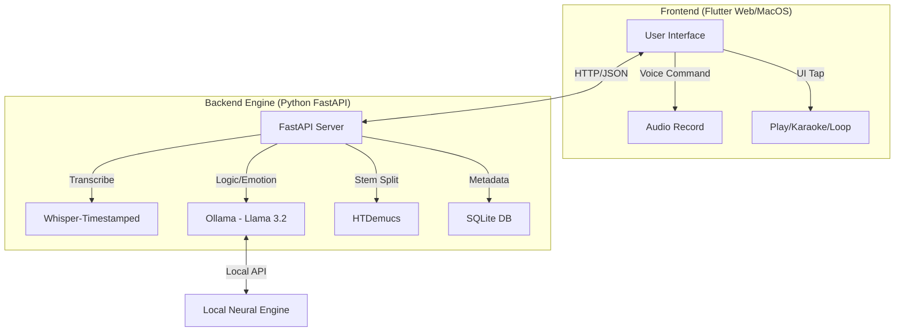

# NEIPRAX is an Agentic Emotional Music System. It combines a Python FastAPI backend (The Brain) with a Flutter Web frontend designed with a retro Sony Walkman aesthetic.

## Architecture Flow
This diagram illustrates how your Flutter frontend communicates with the Python "Brain" and the AI models running on your M4 Mac.



---

## Installation & Setup Guide

### 1. Prerequisites
- **Python 3.13+** (Standard for 2026)
- **Flutter 3.41+**
- **Ollama** (Running locally)
- **Homebrew** (For PortAudio and FFmpeg)

brew install portaudio sqlite3 ffmpeg

python3 -m venv venv
source venv/bin/activate

pip install whisper-timestamped
pip install -U demucs

curl -LsSf https://astral.sh/uv/install.sh | sh

ollama pull mervinpraison/llama3.2-tamil

Start Whisper	pip install whisper-timestamped	This is Multilingual. It will automatically detect if a song is English or Tamil and give you the text + timestamps.
Start Demucs	pip install demucs	This handles the Karaoke part. It doesn't care about language; it just separates the math of the "Voice" from the "Instruments."
Set up the Database	Create neiprax.db	This stores your song paths so your Flutter app doesn't have to "re-scan" every time you open it.


Backend Setup (The Brain)
brew install portaudio sqlite3 ffmpeg
cd neiprax_app/engine
python3 -m venv venv
source venv/bin/activate
pip3 install -r requirements.txt
pip3 install mutagen 
python3 init_db.py
python3 scanner.py


Frontend Setup (The Walkman)
export PATH="$PATH:[YOUR_FLUTTER_PATH]/bin"
cd neiprax_web
flutter pub get
flutter run -d chrome


The AI Engine (Ollama)
ollama serve

The Python Backend
cd neiprax_app/engine
source venv/bin/activate
uvicorn main:app --reload


### 2. Quick Start Command
To start the entire system, open three terminal tabs and run:

**Tab 1 (Ollama):**
```bash
ollama serve
```

**Tab 2 (Python Backend):**
```bash
cd engine
source venv/bin/activate
uvicorn main:app --reload
```

**Tab 3 (Flutter Frontend):**
```bash
cd neiprax_web
flutter run -d chrome
```

---

Your Final Terminal Layout (Running the Whole System)

Terminal Tab	Command	What it does
Tab 1	ollama serve	Starts the AI Engine.
Tab 2	uvicorn main:app --reload	Starts the "Brain" API.
Tab 3	flutter run -d chrome	Starts the Sony Walkman UI.

## Solved Issues Registry
- **Error 72 (xcodebuild):** Resolved by switching to Chrome target or installing full Xcode.app.
- **ModuleNotFoundError (karaoke):** Resolved by running uvicorn from the engine directory.
- **TextStyle 'family' error:** Corrected to 'fontFamily'.
- **SDK Version Mismatch:** Downgraded pubspec.yaml requirement to 3.11.1 to match system.
