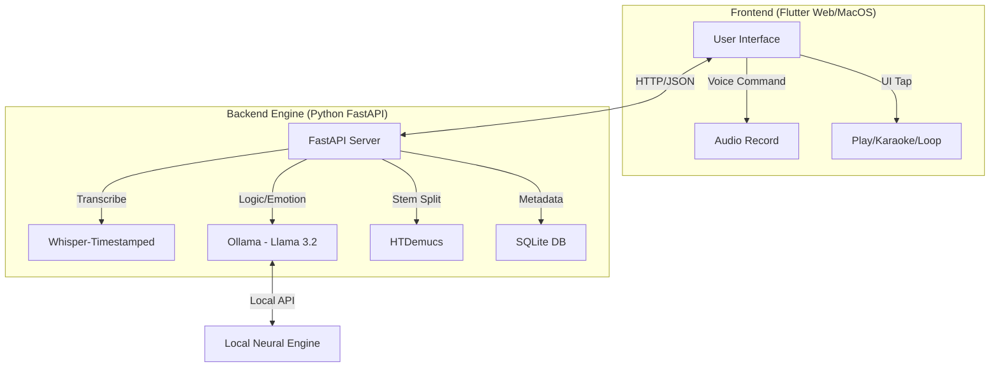
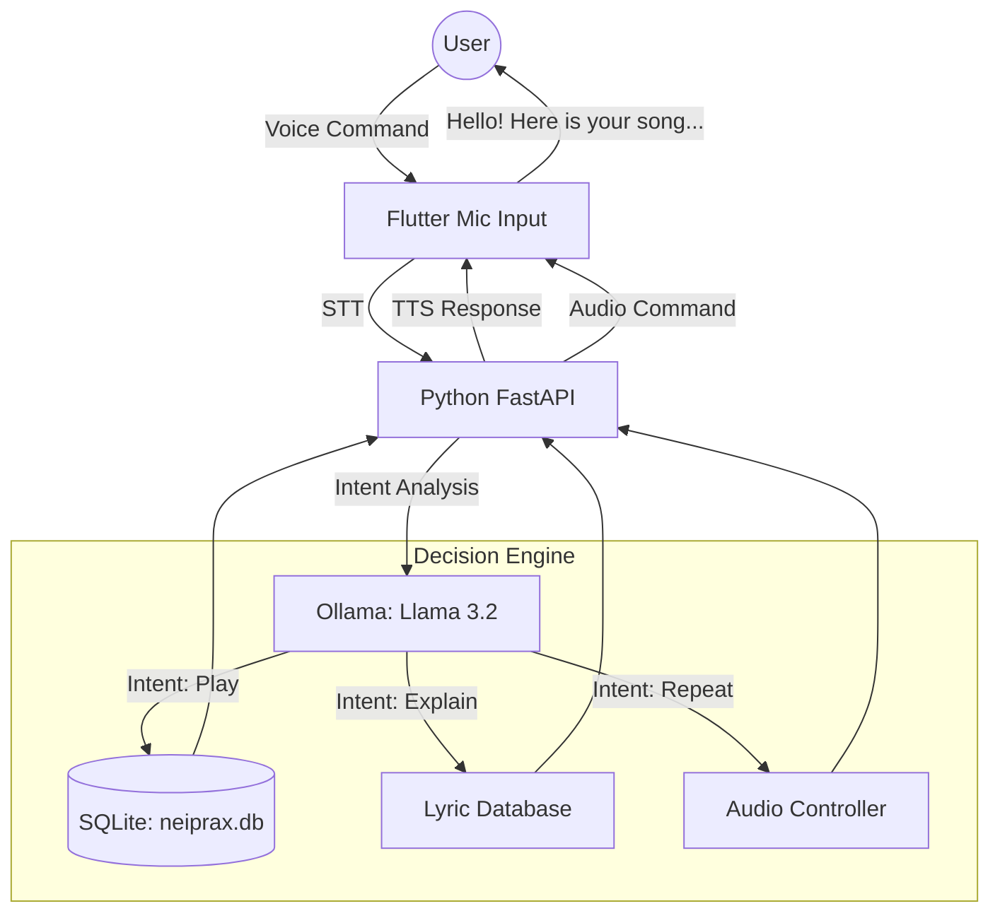

# NEIPRAX: Name History

We chose NEIPRAX as a portmanteau of "Neiro" (representing sound/color) and "Prana" (the life force), with the "X" adding a futuristic, agentic edge. It perfectly captures your vision of an AI that breathes "Neural Life" into music by understanding its emotional pulse and cultural depth.

# NEIPRAX: Agentic Emotional Music System

NEIPRAX combines a Python FastAPI backend (The Brain) with a Flutter Web frontend designed with a retro Sony Walkman aesthetic.

---

## Architecture Flow

This diagram illustrates how your Flutter frontend communicates with the Python "Brain" and the AI models running on your M4 Mac.



---



---

## Installation & Setup Guide

### 1. Prerequisites

- **Python 3.13+** (Standard for 2026)
- **Flutter 3.41+**
- **Ollama** (Running locally)
- **Homebrew** (For PortAudio and FFmpeg)

```bash
brew install portaudio sqlite3 ffmpeg

python3 -m venv venv
source venv/bin/activate

pip install whisper-timestamped
pip install -U demucs

curl -LsSf https://astral.sh/uv/install.sh | sh

ollama pull mervinpraison/llama3.2-tamil
```

- **Start Whisper**: `pip install whisper-timestamped` (This is Multilingual. It will automatically detect if a song is English or Tamil and give you the text + timestamps.)
- **Start Demucs**: `pip install demucs` (This handles the Karaoke part. It doesn't care about language; it just separates the math of the "Voice" from the "Instruments.")
- **Set up the Database**: Create `neiprax.db` (This stores your song paths so your Flutter app doesn't have to "re-scan" every time you open it.)

#### Backend Setup (The Brain)

```bash
brew install portaudio sqlite3 ffmpeg
cd neiprax_app/engine
python3 -m venv venv
source venv/bin/activate
pip3 install -r requirements.txt
pip3 install mutagen 
python3 init_db.py
python3 scanner.py
```

#### Frontend Setup (The Walkman)

```bash
export PATH="$PATH:[YOUR_FLUTTER_PATH]/bin"
cd neiprax_web
flutter pub get
flutter run -d chrome
```

#### The AI Engine (Ollama)

```bash
ollama serve
```

#### The Python Backend

```bash
cd neiprax_app/engine
source venv/bin/activate
uvicorn main:app --reload
```

### 2. Quick Start Command

To start the entire system, open three terminal tabs and run:

**Tab 1 (Ollama):**

```bash
ollama serve
```

**Tab 2 (Python Backend):**

```bash
cd engine
source venv/bin/activate
uvicorn main:app --reload
```

**Tab 3 (Flutter Frontend):**

```bash
cd neiprax_web
flutter run -d chrome
```

---

### Your Final Terminal Layout (Running the Whole System)

| Terminal Tab | Command                        | What it does                  |
|--------------|--------------------------------|-------------------------------|
| Tab 1        | `ollama serve`                | Starts the AI Engine.         |
| Tab 2        | `uvicorn main:app --reload`   | Starts the "Brain" API.       |
| Tab 3        | `flutter run -d chrome`       | Starts the Sony Walkman UI.   |

---

## Solved Issues Registry

- **Error 72 (xcodebuild):** Resolved by switching to Chrome target or installing full Xcode.app.
- **ModuleNotFoundError (karaoke):** Resolved by running uvicorn from the engine directory.
- **TextStyle 'family' error:** Corrected to 'fontFamily'.
- **SDK Version Mismatch:** Downgraded pubspec.yaml requirement to 3.11.1 to match system.

---

## Project Roadmap: NEIPRAX AI Music Agent

We have successfully built the functional core of NEIPRAX. The system now "sees" your music, "thinks" about the emotion using local AI, and "paints" the Walkman UI to match.

Below is the structured breakdown of what is done and what remains to reach a polished Version 1.0.

### 1. Completed Milestones (The Foundation)

| Component       | Status   | Key Features Delivered                                      |
|------------------|----------|------------------------------------------------------------|
| Local Brain      | ✅ Done  | Ollama running Llama 3.2 Tamil for bilingual emotional analysis. |
| Memory           | ✅ Done  | SQLite (neiprax.db) storing paths, emotions, and meanings. |
| Backend API      | ✅ Done  | FastAPI serving metadata (/get-song-info) and streaming audio (/songs). |
| The Librarian    | ✅ Done  | Scanner.py & Enricher.py scripts for auto-indexing your assets/mp3. |
| Walkman UI       | ✅ Done  | Flutter Web skeuomorphic design with Dynamic Theming (Yellow/Blue/Pink). |
| Audio Engine     | ✅ Done  | just_audio integration with reel-spinning animations synced to playback. |

---

### 2. Pending Milestones (The "Agentic" Intelligence)

To make NEIPRAX a true "Agent" rather than just a player, we need to complete these three technical tracks:

#### Track A: Real-Time Lyric Synchronization

- **Goal:** The status screen should show the Tamil meaning line-by-line as the singer sings.
- **Action:** Integrate whisper-timestamped or stable-ts in the Python backend to generate word-level JSON files.
- **Flutter Task:** Use a StreamBuilder on the audio position to trigger text updates.

#### Track B: Voice-to-Intent (The "Agent" Ear)

- **Goal:** Use the Red Mic button to control the system.
- **Commands to Support:**
  - "Play something romantic."
  - "What does this line mean in Tamil?"
- **Action:** Implement Speech-to-Text (STT) in Flutter and a Semantic Router in Python to map voice to SQL queries.

#### Track C: Hardware Polish & UX

- **Volume Wheel:** A physical-looking rotary knob that adjusts `_audioPlayer.volume`.
- **Library Drawer:** A side-sliding menu to browse all 100+ songs in your database.
- **Eject Animation:** A 3D transition where the cassette door tilts when you stop the music.

---

### 3. Strategic Roadmap for Cursor AI

When you open Cursor, use this list as your "Daily Sprint" guide.

#### Immediate Next Steps (Next 24 Hours):

- **Build the LibraryScreen:** Create a new Flutter screen that lists all songs from `SELECT * FROM songs`.
- **Volume & Seek Bar:** Add a retro-styled slider so you can skip through long English/Tamil tracks.
- **Error Handling:** Add a "Retry" button if the FastAPI server isn't started.

#### Future Expansion (The M4 Neural Engine Advantage):

- **Offline Mode:** Move the Python logic into Native MacOS (C++/Dart FFI) so the app works without a local terminal running uvicorn.
- **Mood Pulse:** Make the Walkman body "throb" its color intensity based on the RMS (Loudness) of the music.

---

### Phase 4: The Agentic Intelligence (Voice & Brain)

#### 1. Mood-Based Interaction (The Greeting)

- **Feature:** When the user opens the app, the Agent (Ollama) analyzes the time of day, current weather (if available), and the user's last played songs to start a conversation.
- **Example:** "Good evening! It’s been a rainy day in Chennai. Should we listen to something soulful like 'Vaseegara' to match the mood?"

#### 2. Intent-Based Voice Control (The "Ear")

- **Feature:** The Red Mic Button activates a listener that sends your voice command to the Python "Brain" to execute actions.
- **Capabilities:**
  - **Mood Picking:** "Play something energetic for my workout."
  - **Selective Repeat:** "Neiprax, repeat just that last verse again."
  - **Bilingual Meaning:** "What does the second line mean?"

#### 3. Smart Karaoke Mode

- **Feature:** A dedicated toggle that uses HTDemucs (on your backend) to separate vocals from instruments in real-time or via pre-processing.
- **Capability:** When you say "Switch to karaoke," the app lowers the vocal track and highlights the Tamil lyrics on the status screen so you can sing along.

#### 4. Deep Lyrical "Music Talk"

- **Feature:** Since Llama 3.2 is a full LLM, you can have a conversation about the music itself.
- **Example Conversation:**

```plaintext
User: "Why is this song so famous in Tamil cinema?"
Agent: "This track by A.R. Rahman revolutionized the use of electronic synths in the 90s. The lyrics by Vairamuthu use metaphors from nature to describe love..."
```